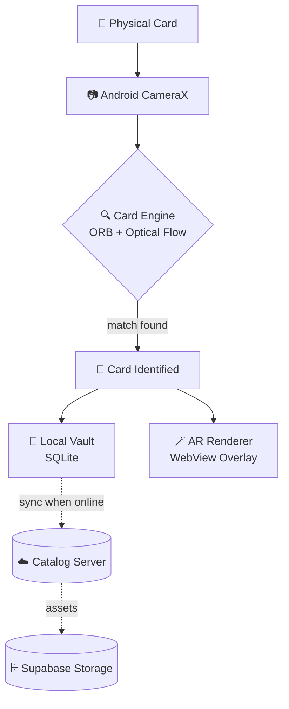
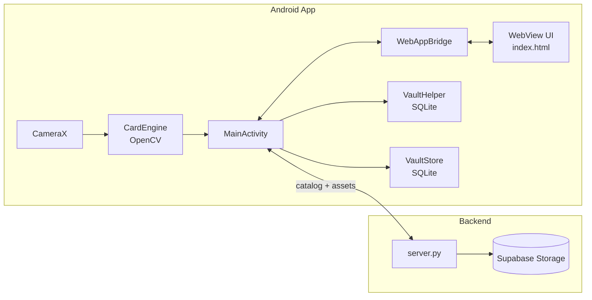

<div align="center">

# 🎴 CARD VISION

### Physical cards. Digital ownership. Augmented reality.

An Android app that recognizes real, physical trading cards through the camera and brings them to life — no ARCore, no markers, just computer vision.


**[Screenshots](#-screenshots) · [How it works](#-how-it-works) · [Architecture](#-architecture) · [The Prototype](#-the-prototype) · [Status](#-project-status) · [Contributing](#-contributing)**

</div>

---

## 📷 Screenshots

<table>
<tr>
<td width="50%"><p align="center"><sub><b>Home</b></sub></p></td>
<td width="50%"><p align="center"><sub><b>Scan</b></sub></p></td>
</tr>
<tr>
<td width="50%"><p align="center"><sub><b>Vault</b></sub></p></td>
<td width="50%"><p align="center"><sub><b>Settings</b></sub></p></td>
</tr>
</table>

## ✨ What it does

<table>
<tr>
<td width="25%" valign="top">

### 📷 Scan
On-device computer vision (OpenCV ORB + optical-flow tracking) finds and tracks a physical card in the live camera feed. No internet required.

</td>
<td width="25%" valign="top">

### 🎴 Vault
Claimed cards persist locally in SQLite — name, rarity, artwork, and animation, all available fully offline.

</td>
<td width="25%" valign="top">

### 🪄 AR Overlay
A matching render is warped onto the tracked card in real time, with optional looping animation layered on top.

</td>
<td width="25%" valign="top">

### 🔄 Trade
Peer-to-peer card transfer between two phones via a locally-generated QR code — no server required to complete a trade.

</td>
</tr>
</table>

## 🧭 How it works



> [!NOTE]
> Recognition and tracking happen **entirely on-device**. The server is only ever consulted for the card catalog and asset downloads — never for identifying what's in front of the camera.

## 🏗️ Architecture



<details>
<summary><b>Layer responsibilities</b></summary>

<br>

| Layer | Owns |
|---|---|
| **Android app** | CameraX, permissions, flashlight, local persistence, networking, asset caching, WebView hosting |
| **WebView UI** | Home / Scan / Vault / Settings screens, AR overlay presentation, navigation, trade UI |
| **WebAppBridge** | The one-and-only contract between native Kotlin and the WebView's JavaScript |
| **server.py** | Card catalog list, asset relay from Supabase, lightweight `/health` endpoint |
| **Supabase** | Durable storage for card artwork, reference images, and animation frames |

</details>

## 🥚 The Prototype

Every project has a beginning. Before CARD VISION became a larger AR card platform, there was **Blue Omelett**.

<div align="center">

</div>

Blue Omelett wasn't the finished system — it was proof the physical-card idea could become something real. **That prototype gave the project a reason to keep going**, and the repo keeps it around on purpose: CARD VISION is also a record of the experiments and iterations that got it here.

## 📦 Project Status

- [x] CameraX scanning pipeline
- [x] On-device card recognition & tracking (OpenCV)
- [x] WebView UI + native JS bridge
- [x] Local persistent vault (offline-first)
- [x] Physical card claiming via QR
- [x] Render + animation caching
- [x] Server-backed catalog with Supabase asset storage
- [x] Seen vs. Owned card states
- [x] Peer-to-peer trading (local QR handshake)
- [ ] Cold-start UX for sleeping free-tier servers
- [ ] Repository hygiene pass (signing, network security config)

> [!TIP]
> See [`docs/KNOWN_ISSUES.md`](docs/KNOWN_ISSUES.md) for the current list of open bugs and rough edges.

## 📁 Repository Structure

```text
CARD-VISION/
├── README.md
├── CONTRIBUTING.md
├── SECURITY.md
├── CODE_OF_CONDUCT.md
├── CHANGELOG.md
├── .gitignore · .gitattributes · .env.example
├── android/                 # The Kotlin app (CameraX, OpenCV, WebView UI)
├── server/                  # Python catalog/asset server + Supabase integration
├── docs/
│   ├── ARCHITECTURE.md · DATA_STORAGE.md · ASSET_PIPELINE.md
│   ├── RELEASE.md · REPOSITORY_SETUP.md · KNOWN_ISSUES.md
│   └── media/                # Screenshots + Blue Omelett
└── .github/
    ├── ISSUE_TEMPLATE/ · PULL_REQUEST_TEMPLATE.md
    ├── CODEOWNERS · dependabot.yml
    └── workflows/
```

## ⚠️ Development Principles

> [!IMPORTANT]
> A change that fixes one thing but silently breaks scanning, permissions, flashlight control, vault persistence, or server detection is a **regression**, not a fix.

<details>
<summary><b>High-risk areas — review changes here extra carefully</b></summary>

<br>

`MainActivity` · `VaultStore` · `VaultHelper` · `WebAppBridge` · `CameraX` setup · `CardEngine` · `server.py` · Supabase storage layout · claim flow · trade flow · WebView UI

**After touching scanning:** test camera permission, startup/shutdown, card detection, server detection, flashlight, AR overlay.
**After touching the vault:** test owned cards, seen cards, persistence across restart, render assets, animations.
**After touching the bridge:** test every native method the WebView calls, navigation, scanner start/stop, settings, vault refresh.

</details>

<details>
<summary><b>Large animation assets</b></summary>

<br>

Android's SQLite `CursorWindow` has practical row-size limits. Large animation payloads belong on disk, not in a database blob:

```text
Small metadata  -> SQLite / local metadata
Large animation -> Disk / file cache
```

</details>

## 🔐 Security

> [!WARNING]
> Never commit `.env`, Supabase service-role keys, API keys, passwords, signing credentials, or certificates. If one slips through, treat it as compromised immediately — rotating it is the only real fix; rewriting git history alone does not unpublish it. See [`SECURITY.md`](SECURITY.md).

## 🤝 Contributing

Read [`CONTRIBUTING.md`](CONTRIBUTING.md), [`docs/ARCHITECTURE.md`](docs/ARCHITECTURE.md), [`docs/DATA_STORAGE.md`](docs/DATA_STORAGE.md), and [`docs/ASSET_PIPELINE.md`](docs/ASSET_PIPELINE.md) before opening a PR. Small, testable changes are strongly preferred over large rewrites — see the [PR checklist](.github/PULL_REQUEST_TEMPLATE.md).

---

<div align="center">
<sub><b>CARD VISION</b> — Physical cards. Digital ownership. Augmented reality.</sub>
</div>
