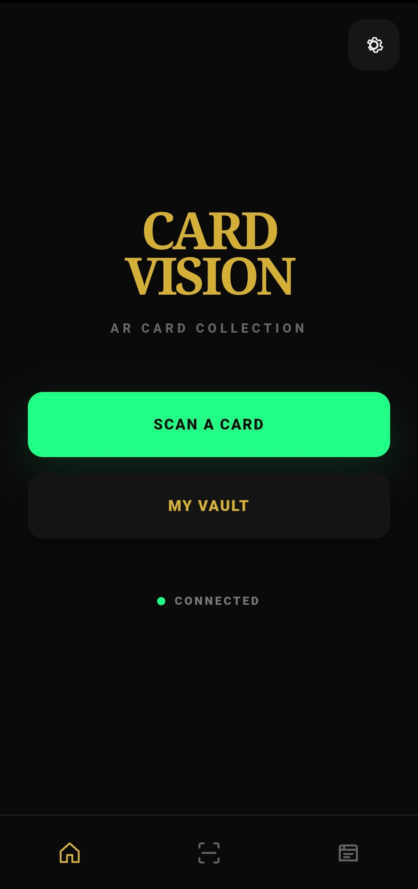
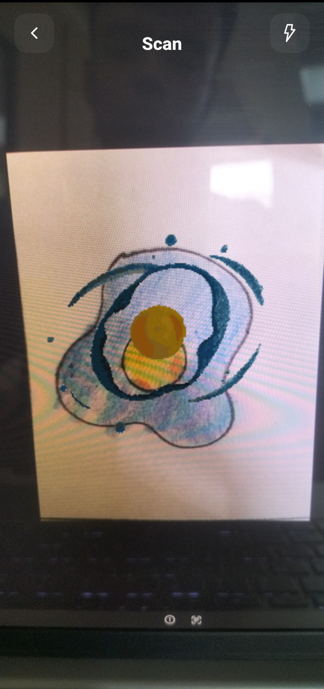
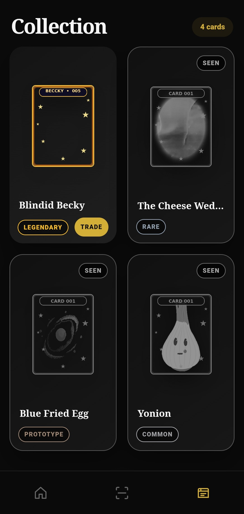
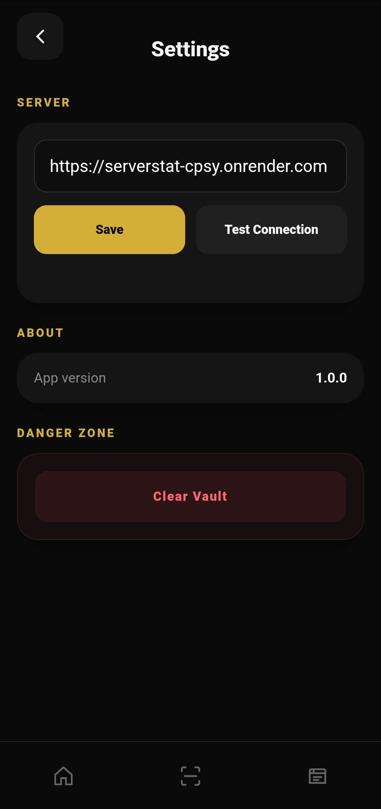

# CARD VISION

> Physical cards. Digital ownership. Augmented reality.

CARD VISION is an Android augmented-reality card collecting system connecting physical cards with digital ownership, persistent storage, animated AR content, remote card services, and future peer-to-peer trading.

## Screenshots

### HOME


### SCAN


### VAULT


### SETTINGS


## The Prototype

Every project has a beginning.

Before CARD VISION became a larger AR card platform, there was **Blue Omelett**.


Blue Omelett represents one of the earliest physical-card prototypes behind the project.

It was not the finished system. It was proof that the idea could become something real.

**That prototype gave the project a reason to keep going.**

The repository intentionally preserves that history because CARD VISION is also a record of the experiments, prototypes, technical problems, and iterations that made the larger system possible.

## Project Status

CARD VISION is an active prototype / development project.

Current systems include:

- Android application
- CameraX scanning
- WebView UI
- Native JavaScript bridge
- Card recognition
- Local persistent vault
- Physical card claiming
- Render caching
- Animation caching
- Server-backed catalog
- Supabase asset storage
- Demo mode
- Seen / Owned card states
- Trading UI and P2P infrastructure

## Architecture

```text
Physical Card
     |
     v
Android CameraX
     |
     v
Card Detection / Recognition
     |
     +--------------> Server Catalog
     |
     +--------------> Local Vault
     |
     +--------------> AR Renderer
                            |
                            v
                        WebView UI
                            |
                            v
                     Animated Content
```

The Android application owns device-level functionality such as CameraX, permissions, flashlight control, local persistence, networking, asset caching, and WebView hosting.

The WebView owns presentation and interaction such as HOME, SCAN, VAULT, SETTINGS, AR overlay presentation, navigation, and trade UI.

The WebAppBridge connects the two layers.

## Repository Structure

```text
CARD-VISION/
├── README.md
├── CONTRIBUTING.md
├── SECURITY.md
├── CODE_OF_CONDUCT.md
├── CHANGELOG.md
├── .gitignore
├── .gitattributes
├── .env.example
├── docs/
│   ├── ARCHITECTURE.md
│   ├── DATA_STORAGE.md
│   ├── ASSET_PIPELINE.md
│   ├── RELEASE.md
│   ├── REPOSITORY_SETUP.md
│   ├── KNOWN_ISSUES.md
│   └── media/
│       ├── Blue Omelett.jpg
│       ├── Home.jpg
│       ├── Scan.jpg
│       ├── Vault.jpg
│       └── settings.jpg
└── .github/
    ├── PULL_REQUEST_TEMPLATE.md
    └── ISSUE_TEMPLATE/
        ├── bug_report.md
        └── feature_request.md
```

## Development Principles

CARD VISION is being developed with a strong emphasis on preserving working functionality.

Changes touching these areas should be treated carefully:

- MainActivity
- VaultStore
- WebAppBridge
- CameraX
- CardEngine
- server.py
- Supabase storage
- animation handling
- claiming
- trading
- WebView UI

A change that fixes one feature but silently breaks scanning, permissions, flashlight control, vault persistence, or server detection is a regression.

## Large Animation Assets

Animation bundles can become very large. Android SQLite CursorWindow limits mean large animation payloads should not be treated like ordinary small database fields.

Preferred architecture:

```text
Small metadata -> SQLite / local metadata
Large animation bundle -> Disk / file cache
```

## Security

Never commit Supabase service keys, API keys, passwords, private signing keys, .env files, credentials, or private certificates.

See `SECURITY.md`.

## Contributing

Read `CONTRIBUTING.md`, `docs/ARCHITECTURE.md`, `docs/DATA_STORAGE.md`, `docs/ASSET_PIPELINE.md`, and `docs/KNOWN_ISSUES.md`.

## Project History

CARD VISION started from experimentation. The **Blue Omelett** prototype is part of that history and should remain documented in the repository.

It represents the point where the physical-card idea started becoming tangible.

> A physical card that can become something more when viewed through the application.

## Authoring Philosophy

CARD VISION is intentionally being built incrementally. Preserve working functionality, make the smallest safe change, test the affected path, check for regressions, document architectural changes, and only then expand the system.

**CARD VISION** — Physical cards. Digital ownership. Augmented reality.
